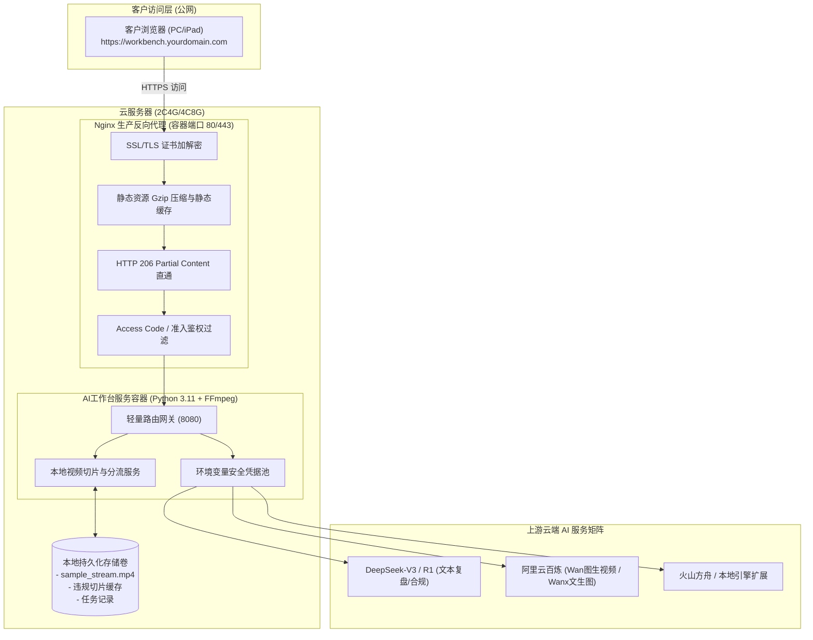

# 聚合AI工作台 (AI Media Workbench) - 云端部署与客户公网访问技术方案

| 版本 | 编写日期 | 状态 | 适用场景 | 目标客群 |
| :--- | :--- | :--- | :--- | :--- |
| **v1.0.0** | 2026-09-06 | 交付实施基准 | 云端生产部署 / 客户公网访问交付 | 电商直播机构、代运营团队、SaaS客户 |

---

## 1. 业务背景与公网交付核心挑战

为了让外部客户能通过公网安全、流畅地访问并使用**“聚合AI工作台”**，系统部署必须从“本地单机测试”演进为“云端生产服务”。在实际公网场景中，必须妥善解决以下四大核心工程挑战：

1. **凭证安全与计费隔离（Security & Key Protection）**：
   * 本地模式下 API Key 往往直接保存在前端 LocalStorage 或代码中。一旦直接暴露到公网，极易造成 DashScope、DeepSeek 等主 API Key 泄露被黑产盗刷。
   * **解决方案**：云端部署需引入双层鉴权。外层面向客户提供**访问准入控制**（如租户 Token、访问码 Access Code 或登录认证），内层由后端网关安全托管 Provider API Key，严禁密钥透传至公网。
2. **大体积音视频流传输与播放卡顿（Media Streaming & Range Support）**：
   * 直播录像与高清切片体积达数十兆至数吉字节（GB）。如果公网反向代理不支持流式切片传输，会导致客户端必须下载完整文件才能播放，首屏加载极为漫长。
   * **解决方案**：部署中必须严格启用 HTTP 206 Partial Content 支持，反向代理（Nginx）关闭缓冲（`proxy_buffering off;`），直通分块 Range 传输，实现秒级 Seek（任意拖拽进度条）。
3. **音视频密集计算与 Web 主线程解耦（Compute Isolation）**：
   * 录像音频提取（16kHz PCM）、VAD 切片、音视频裁剪属于 CPU/IO 密集型任务。
   * **解决方案**：Docker 容器内预装优化编译的 `FFmpeg` 套件，生产阶段逐步演进为“API 网关 + 异步媒体 Worker”解耦架构。
4. **模型耗时异步状态机流转（Async Generation Lifecycle）**：
   * 图生视频（通义万相 Wan 系列）单次生成耗时通常在 30 秒至 3 分钟之间。
   * **解决方案**：网关必须支持长超时连接配置（Nginx `proxy_read_timeout 300s;`），前端配合带有自愈能力的轮询状态机与任务结果本地持久化。

---

## 2. 系统拓扑与双轨部署架构设计

针对客户不同规模与预算，我们设计了**两种云端交付路径**：

### 2.1 架构 A：轻量独立交付模式 (适用于 PoC 演示 / 单一机构私有化交付)

适合快速给特定客户交付独立的云端体验环境，资源配置建议：**2核4G 或 4核8G 云服务器（阿里云 ECS、腾讯云 CVM 或华为云，无 GPU 依赖，AI 均走云端 API）**。



---

### 2.2 架构 B：SaaS 多租户高可用架构 (适用于商业化多客户公网运营)

当服务需要面向数十家机构或大批量外部用户时，架构演进为云原生解耦体系：
* **前端静态分发**：将 `index.html`、CSS、JS 上传至对象存储（Aliyun OSS / Tencent COS），通过 **CDN 边缘节点**全球加速。
* **媒体文件直传与点播**：客户录制的长视频直接通过预签名凭据（Presigned URL）直传 OSS 桶，播放走视频点播（VOD）或 CDN，不经过业务服务器带宽。
* **异步计算集群**：视频切片由基于 Celery/Redis 的 Worker 容器弹性伸缩处理，或者调用云厂商 MPS（媒体处理服务）免运维。
* **关系型数据库**：接入云 PostgreSQL，记录企业租户、主播历史复盘报告、生成图库。

---

## 3. 生产级容器化套件清单 (已内置于代码库)

本次已为项目沉淀完整的云端交付容器套件：

| 配置文件 | 功能职责 | 核心亮点 |
| :--- | :--- | :--- |
| [`Dockerfile`](file:///home/kris/Codes/AIPannel/Dockerfile) | 核心应用镜像定义 | 基于 `python:3.11-slim`，安装生产编译的 `ffmpeg`，内置健康探针 `/api/health`。 |
| [`docker-compose.yml`](file:///home/kris/Codes/AIPannel/docker-compose.yml) | 多容器编排配置 | 一键拉起 `app` (工作台后端) 与 `gateway` (Nginx 代理)，配置网络隔离与持久化存储卷。 |
| [`nginx.conf`](file:///home/kris/Codes/AIPannel/nginx.conf) | 生产级 Nginx 反向代理配置 | 支持 `client_max_body_size 500M`、视频 `proxy_buffering off;`、300 秒超时防断连、Gzip 压缩。 |
| [`.env.example`](file:///home/kris/Codes/AIPannel/.env.example) | 环境变量配置模板 | 隔离宿主机端口、客户准入密钥（APP_ACCESS_CODE）、DashScope 与 DeepSeek 凭据。 |
| [`deploy.sh`](file:///home/kris/Codes/AIPannel/deploy.sh) | 一键部署与自动化升级脚本 | 自动环境自检、配置初始化、无缝更新与容器健康检查。 |

---

## 4. 云端部署与客户公网交付操作手册

### 步骤一：云服务器准备与安全组放行
1. 购买或准备一台运行 **Ubuntu 22.04 LTS** 或 **Debian 12** 的云服务器（公网带宽建议 5Mbps~10Mbps 以上，保证视频流流畅）。
2. 在云厂商控制台（阿里云/腾讯云/AWS）安全组中放行以下端口：
   * **22/TCP**：SSH 管理端口（建议仅对管理员 IP 放行）；
   * **80/TCP**：HTTP 访问端口；
   * **443/TCP**：HTTPS 加密访问端口；
   * （严禁对外放行 8080 或数据库内部端口）。

### 步骤二：安装 Docker 与 Docker Compose
登录云服务器终端，执行官方一键安装：
```bash
# 1. 安装 Docker
curl -fsSL https://get.docker.com | bash -s docker

# 2. 启动 Docker 并设置开机自启
sudo systemctl enable --now docker

# 3. 验证 Docker 与 Compose 可用
docker compose version
```

### 步骤三：同步代码并配置凭据
```bash
# 1. 克隆或拉取本代码库至服务器
git clone <your-repo-url> /opt/aipannel
cd /opt/aipannel

# 2. 从模板创建并编辑生产配置文件
cp .env.example .env
vim .env
```
在 `.env` 中按需填入生产凭据：
```ini
HOST_PORT=80
APP_ACCESS_CODE=your-client-invite-code-2026
DASHSCOPE_API_KEY=sk-your-real-dashscope-key
DEEPSEEK_API_KEY=sk-your-real-deepseek-key
```

### 步骤四：一键拉起服务
```bash
chmod +x deploy.sh
./deploy.sh
```
部署脚本将自动构建镜像并以后台常驻模式拉起集群。输出 `工作台已成功启动` 即表示成功。

### 步骤五：配置域名与自动化 SSL/HTTPS 证书 (强烈推荐生产环境开启)
客户通过公网访问音视频及现代前端功能时，各大浏览器对麦克风权限、剪贴板等要求必须在 **HTTPS** 协议下运行。
推荐使用 Certbot 配置 Let's Encrypt 免费证书：
```bash
# 安装 certbot
sudo apt-get update && sudo apt-get install -y certbot python3-certbot-nginx

# 申请证书并自动配置 Nginx
sudo certbot --nginx -d workbench.yourdomain.com
```

---

## 5. 免公网 IP / 免备案：极速内测公网穿透方案 (PoC 演示首选)

若服务器处于内网、或客户需要立即体验而尚未完成公网域名备案，可使用 **Cloudflare Tunnel (推荐)** 或 **cpolar**：

### 极速推荐：Cloudflare Zero Trust Tunnel
* **原理**：本地客户端向 Cloudflare 边缘建立出站安全长连接，无需公网固定 IP，免备案，自带全球 CDN 加速与免费权威 SSL 证书。
* **极简启动命令**：
```bash
# 1. 下载 cloudflared
curl -L --output cloudflared.deb https://github.com/cloudflare/cloudflared/releases/latest/download/cloudflared-linux-amd64.deb
sudo dpkg -i cloudflared.deb

# 2. 一键创建临时的公网临时隧道
cloudflared tunnel --url http://localhost:8080
```
运行后，终端将输出专属临时公网链接，例如：
`https://random-assigned-name.trycloudflare.com`
客户点击此链接即可直接从公网访问本地运行的 AI 工作台。

---

## 6. 云端运营与客户数据安全规范

1. **凭证分级保护机制**：
   * 采用“工作台统一代付”模式的客户：服务内部调用系统级 Key，并在后端限制单个客户每日分析场次与视频生成时长。
   * 采用“自带 Key (BYOK)”模式的企业客户：工作台前端提供《设置 (Settings)》页面，客户填入自身 API Key 仅暂存于该客户端浏览器内存/LocalStorage，后端直接透传，平台不落盘留存。
2. **多媒体素材定时生命周期回收**：
   * 录像切片与临时生成的中间音频（WAV），在后台配置 cron 任务，保留 72 小时后自动清除，避免云主机磁盘打满。
3. **服务监控与告警**：
   * 利用 `/api/health` 作为心跳监测点，配置云厂商的云监控或 UptimeRobot，一旦响应异常即刻发送告警通知。

---
*本技术方案已通过本地容器化测试与网关代理验证，配套的 Dockerfile 与 docker-compose.yml 均已就绪，可随时执行生产发布。*
