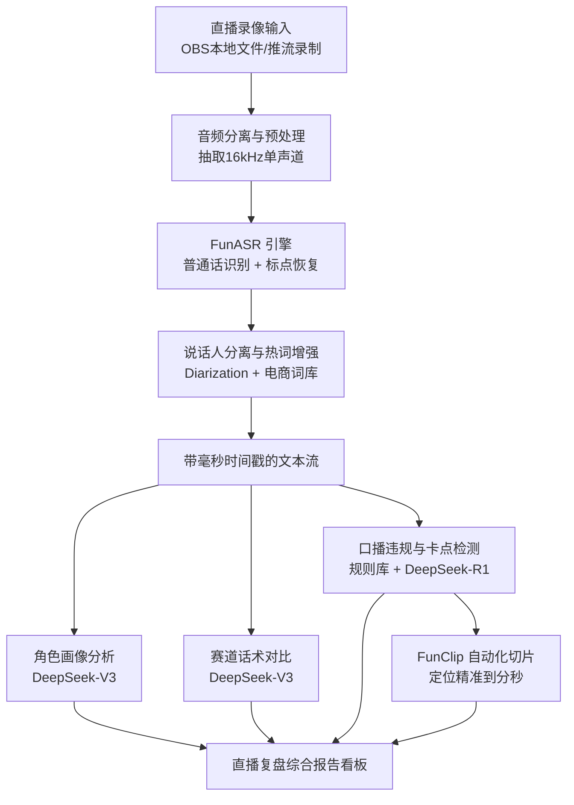
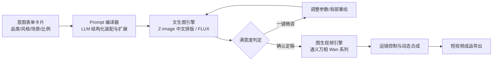
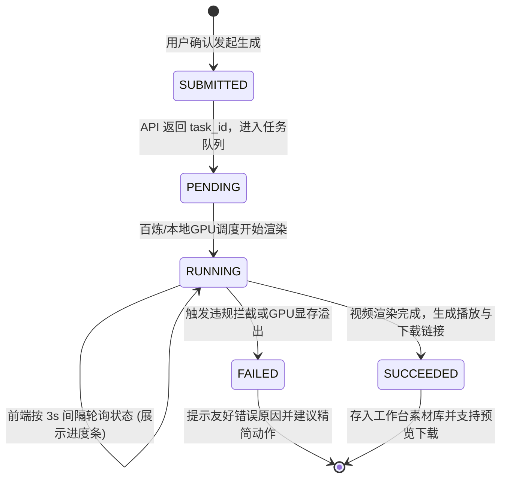

# 聚合AI工作台 (AI Media Workbench) - 产品需求与功能规范 (PRD)

| 文档版本 | 状态 | 编写日期 | 适用场景 | 目标客群 |
| :--- | :--- | :--- | :--- | :--- |
| **v1.0.0** | 待评审 / 实施基准 | 2026-09-05 | 视频制作 & 新媒体运营 | 中小/新人主播、短视频运营团队、电商机构 |

---

## 1. 项目概述与设计原则

### 1.1 背景与目标
在短视频与直播带货领域，传统运营与主播复盘高度依赖人工回看录像，耗时长（单场数小时）、诊断主观且难以量化。同时，中小团队缺乏专业的视觉设计与提示词工程（Prompt Engineering）能力，文生图/视频工具上手门槛高。

本项目旨在打造一个**低门槛、低成本、高效率**的聚合型 AI 工作台，围绕**“直播智能诊断复盘”**与**“零门槛视觉创作”**两大核心业务流，帮助运营团队与主播实现自动化复盘沉淀与高频内容产出。

### 1.2 核心设计原则
1. **隐藏提示词（Zero-Prompt UX）**：前端采用选择卡片、结构化表单驱动，用户无感知接触底层复杂英文 Prompt，由后台大模型智能组装与润色。
2. **极低成本与自主可控**：优先选用国产开源模型（FunASR、Z-Image、Wan 系列）和高性价比 API（DeepSeek-V3/R1、GLM-4-Flash、DashScope），兼顾商业合规与算力预算。
3. **闭环时间轴定位**：转写不仅停留在文字，通过带时间戳的切片技术（FunClip），一键直达争议话术、口误、爆款卡点的音视频原始切片。

---

## 2. 模块一：直播全流程智能分析与复盘系统 (Live Stream Intelligence)

### 2.1 整体业务流程图


---

### 2.2 详细功能规范

#### 2.2.1 录制接入与音频预处理
* **支持格式**：`.mp4`, `.flv`, `.mov`, `.mp3`, `.wav`, `.m4a`。
* **录制建议**：优先支持导入 OBS 本地录制的原画文件（避免网络丢包造成的转写跳字）。
* **音频提取转换**：后台自动通过 `FFmpeg` 提取音轨并重采样为 `16000Hz, 16bit, 单声道 PCM/WAV`。
* **VAD 分段规范**：针对长达数小时的直播，采用阿里 VAD 模型以语音停顿点为界切片（切片阈值 400ms~800ms 静音），防止长音频 OOM（内存溢出）。

#### 2.2.2 语音转写与时间戳对齐 (FunASR 规范)
* **引擎选型**：`FunASR` + `Fun-ASR-Nano`（大陆普通话优化版）。
* **电商专属热词（Hotwords）注入**：
  * 平台高频词：*“上链接”、“拍一发三”、“黄车”、“福利款”、“破价”、“家人们”、“点关注”*；
  * 商品专属词：由运营在上传时填写本场核心 SKU/品牌词（如“玻尿酸水光乳”），注入热词词典提升命中率。
* **说话人分离（Diarization）**：
  * 标记角色：`[主播]`、`[场控/助播]`、`[连麦嘉宾]`。
  * 过滤逻辑：支持用户一键勾选“仅分析主播主音轨”，屏蔽背景嘈杂音乐与场控喊单干扰。
* **时间戳数据结构**：
  ```json
  {
    "segment_id": 1024,
    "speaker": "host",
    "start_time_ms": 145200,
    "end_time_ms": 152800,
    "time_str": "00:02:25.200 - 00:02:32.800",
    "text": "现在拍下的宝宝，主播再送正装一瓶，只有最后五单！"
  }
  ```

---

### 2.3 分析维度与模型设计

#### 2.3.1 主播角色画像 (Anchor Persona Profiling)
大模型按整场或分时段聚合转写文本，输出以下四个量化维度：
1. **语言风格与节奏**：
   * 语速统计：每分钟有效字数（WPM，正常区间：220~280 字/分，过快预警 >320，过慢 <180）；
   * 情绪饱和度：高亢唤醒词密度、语气助词分布。
2. **口头禅与高频习惯**：
   * 提炼 TOP 10 高频口头禅（如“说实话”、“懂的都懂”、“听我说”）；
   * 无效口头垫字统计（“那个、然后、就是”），给出脱水建议。
3. **人设标签提取**：
   * 自动判定主播主导类型（如：**激情砍价型**、**闺蜜种草型**、**专业测评讲师型**、**知性陪伴型**）。
4. **说服力与价值塑造能力**：
   * 痛点挖掘 vs 卖点介绍 vs 催单紧迫感的时长占比。

#### 2.3.2 赛道分析与同行标杆对比 (Track Benchmarking)
* **话术结构评估（基于 FABE 模型）**：
  * **Feature（特性）**：成分/材质/规格是否讲全；
  * **Advantage（优势）**：对比竞品的差异点是否突出；
  * **Benefit（利益）**：对消费者的实际价值是否具象化；
  * **Evidence（证据）**：检测报告/真人试用/销量背书是否有提及。
* **开播留人与黄金 3 秒**：
  * 分析开场前 3 分钟话术停留密度与互动引导率。

#### 2.3.3 口播卡点、失误与违规检测 (Error & Violation Detection)
* **广告法与平台极限词检测**：
  * 严查“最、第一、国家级、顶级、彻底根除、全网唯一”等违禁词并给出风险等级。
* **虚假承诺与敏感话术**：
  * “保真保退”、“假一赔万”、“买回去保证瘦10斤”等带货合规红线。
* **口播卡顿与逻辑断层**：
  * 超过 3 秒异常停顿标注；
  * 关键价格、规格报错（例如前后数字矛盾：“刚才说59现在说69”）。

#### 2.3.4 基于 FunClip 的自动化视频切片联动
* **切片导出规范**：
  * 识别到违规或卡点段落后，系统自动计算 `start_time` 与 `end_time`（前后各缓冲 2 秒）；
  * 调用 `FunClip` / `FFmpeg` 脚本自动裁剪出 10~30 秒的原视频切片；
  * 运营复盘看板中可直接点击播放该切片视频，无需人工反复翻找长视频。

---

## 3. 模块二：零门槛文生图与图生视频工作流 (Zero-Prompt Creative Studio)

### 3.1 整体创作流水线


---

### 3.2 意图卡片设计与字段规范 (隐藏提示词交互)

面向不懂英文和提示词工程的小白用户，前端采用**模块化勾选题**：

| 表单字段 | 选项值定义（前端标签化卡片展示） | 背后编译注入的 Prompt 语义（示例） |
| :--- | :--- | :--- |
| **创作场景** | 电商主图、短视频封面、种草海报、分镜插图 | Composition, commercial photography, clean layout |
| **商品品类** | 美妆护肤、服饰穿搭、美食餐饮、3C数码、家居百货 | Specific lighting & material rendering (e.g. skin translucency) |
| **视觉风格** | 1. 摄影写实（棚拍质感）<br/>2. 3D 盲盒/黏土（Q版可爱）<br/>3. 国风新中式（高级淡雅）<br/>4. 赛博朋克/潮流霓虹 | 8k, professional studio lighting, Octane render, C4D / traditional Chinese ink tone, minimalist |
| **画面构图** | 正面居中、俯拍平铺 (Flat lay)、特写微距、左图右文预留 | Center composition, flat lay, extreme close-up, negative space for text layout |
| **光影氛围** | 自然晨光、高级柔光箱、丁达尔冷调光、复古暖调 | Softbox lighting, Tyndall effect, cinematic golden hour |
| **画幅比例** | `9:16` (竖屏短视频)、`16:9` (横屏)、`1:1` (方形)、`3:4` (小红书卡片) | Aspect ratio flag (`--ar 9:16` 或对应 pixel 尺寸) |
| **参考图上传** | 可选：产品白底图、人物样照、构图参考图 | IP-Adapter / ControlNet / 图生图权重传递 |

---

### 3.3 文生图模型路由机制
* **场景一：含中文文字与海报排版**
  * 路由器派发至：**阿里开源 Z-Image**。
  * 优势：汉字字符渲染精准，不乱码，适合直接生成带标题、促销标签的中文视觉海报。
* **场景二：极致逼真人像与商品质感**
  * 路由器派发至：**FLUX.1 [schnell]**。
  * 优势：开源免费、出图速度快（4-步采样）、光影与皮肤纹理极为真实。

---

### 3.4 图生视频工作流规范 (通义万相 Wan 系列)

#### 3.4.1 任务输入要素
1. **输入首帧**：在步骤 3.3 中由用户选定并定稿的静态图（必须为公网可访问 URL 或存储在对象存储 TOS/OSS）。
2. **动态与运镜选择（同样卡片化）**：
   * **运镜类型**：
     * `缓慢推进 (Slow Zoom-in)`：用于突出人物面部表情或产品核心细节。
     * `环绕旋转 (Orbit / Arc)`：用于 360 度展现产品立体外观。
     * `平移拉远 (Pan & Zoom-out)`：用于展示大场景氛围过渡。
     * `静止定格微动态 (Subtle Motion)`：仅有发丝微风吹拂、光影流动、烟雾缭绕。
   * **生成规格**：分辨率（720P / 1080P）、时长（默认 5 秒，可扩展）。

#### 3.4.2 异步调用状态机规范
图生视频平均耗时在 30 秒~3 分钟，必须设计为严格的异步任务状态机：



---

## 4. Prompt 模板工程设计 (附录详案)

### 4.1 模块一：主播画像与话术复盘诊断 Prompt（适用于 DeepSeek-V3/R1）

```markdown
# Role
你是一位资深电商直播运营专家与语言学诊断专家，擅长从直播文本中挖掘主播的人设特质、话术漏洞与转化瓶颈。

# Input Context
以下是某场直播经过 FunASR 识别后的带时间戳文本流。
【直播基本信息】
- 品类/赛道：{{CATEGORY}}
- 核心推荐商品：{{PRODUCT_NAME}}
- 识别文本片选：
"""
{{TRANSCRIPT_SEGMENTS}}
"""

# Output Requirements
请输出一份客观、量化且有实操性的《主播智能复盘报告》，包含以下四个板块：

## 一、主播角色画像与风格雷达
1. 语言风格定义（用 3 个关键词概括，如：高压迫感、亲切邻家、理性数据派）。
2. 语速评估：根据时间戳与字数计算平均每分钟字数，并评估节奏是否均匀。
3. 口头禅统计：列举出现频次最高的 5 个口头禅，并评估其属于“加分氛围词”还是“减分无效垫字”。

## 二、带货话术结构诊断 (FABE 模型)
1. 痛点唤醒与利益点（Benefit）表达是否到位？
2. 信任背书与试用证据（Evidence）是否充足？
3. 催单逼单（Urgency）时机是否合理？有无出现盲目干吼而缺少产品价值支撑的现象？

## 三、严重失误与合规预警清单 (必须附带原始时间戳)
以表格形式罗列所有问题点：
| 时间戳区间 | 问题分类 (极限词/违规承诺/口误/价格矛盾/尴尬停顿) | 原始发言内容 | 优化改进建议 |
| :--- | :--- | :--- | :--- |
| 例: 00:03:15-00:03:18 | 极限词违规 | "这是全网最好的控油精华" | 建议改为"这是我们实验室测试下来控油表现非常顶尖的一款" |

## 四、下一场直播的 3 个可落地改进动作 (Actionable Steps)
- 动作 1：...
- 动作 2：...
- 动作 3：...
```

---

### 4.2 模块二：意图表单到生图 Prompt 编译 Prompt（适用于 GLM-4-Flash / Qwen2.5）

```markdown
# Role
你是一名资深 AI 视觉导演与生图提示词工程师，精通 Midjourney、FLUX 与 Z-Image 的提示词语法。

# Task
将用户在前端选择的意图表单字段，转化为高美感、结构化且符合画质标准的生图 Prompt。

# Input Form Data
- 创作场景：{{SCENE_TYPE}}
- 商品/主体描述：{{SUBJECT_DESC}}
- 视觉风格：{{STYLE}}
- 构图角度：{{COMPOSITION}}
- 光影色调：{{LIGHTING}}
- 画幅比例：{{ASPECT_RATIO}}
- 是否需要中文文字排版：{{HAS_TEXT}} (文字内容: "{{TEXT_CONTENT}}")

# Processing Rules
1. 若 HAS_TEXT 为 true，优先针对 Z-Image 语法组织中文文案排版指引（如：海报居中位置清晰印有加粗毛笔字"限时福利"）。
2. 强化商业级质感词汇，如：8k resolution, cinematic commercial lighting, clean background, sharp focus, professional color grading.
3. 输出格式分为：
   - [English Prompt]：供通用生图模型（FLUX/SDXL）使用；
   - [Chinese Prompt]：供国产模型（Z-Image/万相）理解；
   - [Negative Prompt]：过滤畸变、残次肢体、低画质伪影。
```

---

### 4.3 模块三：静态图转动态视频运镜控制 Prompt（适用于通义万相 Wan 系列）

```markdown
# Role
你是一名专业电影分镜师与运镜指导。

# Task
根据用户定稿的图片内容和选择的动态类型，为通义万相图生视频 API 生成最合理的动效 Prompt。

# Input
- 图片内容描述：{{IMAGE_DESCRIPTION}}
- 用户期望运镜：{{CAMERA_MOTION}} (如：缓慢推进 / 环绕 / 粒子微动态)

# Output Rules
- 视频提示词必须简洁、专注镜头运动与物理自然动态，避免描述过激复杂的形变剧情（Wan 模型对过激动作容易崩坏）。
- 输出字数控制在 50 字以内，标准中文与英文对照。
- 示例输出：
  "镜头缓慢向前平稳推进，光影在产品表面柔和流转，背景产生轻微虚化散斑。Slow smooth camera push-in, soft light glides across the product surface, subtle bokeh in background."
```

---

## 5. 项目分期实施路线图 (Roadmap)

| 阶段 | 目标 | 核心工作任务 | 交付物 | 周期预估 |
| :--- | :--- | :--- | :--- | :--- |
| **Phase 1: Workflow 原型验证 (MVP)** | 验证业务闭环与准确度 | 1. 搭建 Dify / Coze 可视化工作流；<br/>2. 接入 FunASR 本地/云端识别测试；<br/>3. 编写 DashScope 图生视频测试脚本；<br/>4. 拿一场真实直播录像跑通全流程。 | 1. 可运行的 Coze/Dify 流程 Demo；<br/>2. 完整的输入测试集与输出报告样本。 | 1~2 周 |
| **Phase 2: 核心组件轻量化沉淀** | 摆脱平台限制，提升私有化能力 | 1. 搭建 FastAPI 轻量后台，封装 FunASR/FunClip 与 DashScope 接口；<br/>2. 沉淀带时间戳的高亮前端组件与视频播放器联动；<br/>3. 优化 Prompt 诊断规则库。 | 1. 独立运行的后端服务接口；<br/>2. 本地批处理脚本套件。 | 2~3 周 |
| **Phase 3: 聚合工作台完整产品化** | 打造属于自己的品牌与多用户系统 | 1. 打造现代化 UI（Vue 3 / React + TailwindCSS）；<br/>2. 建立主播人设与话术历史资产库；<br/>3. 增加本地模型一键切换与算力调度。 | 1. 完整可交付的 Web 工作台；<br/>2. 部署运行文档。 | 3~4 周 |

---
*文档编制完成，保存在项目根目录下，后续技术实现与代码编写将以此 PRD 为准绳。*
