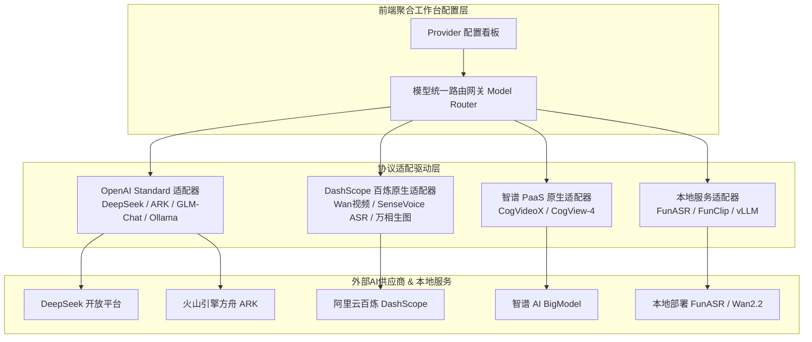

# 主流 AI Provider 最新接口规范与工作台适配方案

| 编制日期 | 版本 | 适用范围 | 文档属性 |
| :--- | :--- | :--- | :--- |
| 2026-09-05 | v1.0.0 | 聚合AI工作台模型适配层 | 技术实现参考与接口规范 |

---

## 一、调研背景与适配目标

聚合AI工作台的核心功能跨越了 **语音转文字（ASR）**、**长文本深度分析（LLM）**、**高质量文生图（T2I）**、以及**长耗时图生短视频（I2V）** 四大多模态任务。为了兼顾国内直连合规性、极低调用成本与开源私有化能力，本方案系统调研并归纳了当前主流国内 Provider 的最新接口协议与调用模式。



---

## 二、主流 AI Provider 最新接口全景矩阵

| 提供商 (Provider) | 典型优势与主打模型 | 认证 Header | 基础端点 (Base URL) | 接口协议模式 |
| :--- | :--- | :--- | :--- | :--- |
| **DeepSeek** | `deepseek-chat` (V3)<br/>`deepseek-reasoner` (R1) | `Authorization: Bearer <KEY>` | `https://api.deepseek.com/v1` | **标准 OpenAI 兼容** |
| **阿里云百炼 (DashScope)** | 通义万相 Wan 系列 (`wan2.1-i2v-turbo`)<br/>`sensevoice-v1`, `qwen-plus` | `Authorization: Bearer <KEY>`<br/>`X-DashScope-Async: enable` | 默认: `https://dashscope.aliyuncs.com`<br/>专属: `https://{WorkspaceId}.cn-beijing.maas.aliyuncs.com` | **原生 DashScope 格式**<br/>(部分 Chat 支持兼容模式) |
| **智谱 AI (BigModel)** | `glm-4-flash` (免费跑量)<br/>`cogvideox-flash`, `cogview-4` | `Authorization: Bearer <KEY>` | `https://open.bigmodel.cn/api/paas/v4` | **Chat 兼容 OpenAI**<br/>**视频/图像使用 PaaS 格式** |
| **火山引擎方舟 (ARK)** | Doubao 豆包全系<br/>Seedream / Seedance | `Authorization: Bearer <KEY>` | `https://ark.cn-beijing.volces.com/api/v3` | **OpenAI 兼容 (EP 定位)** |
| **本地开源 (Local Service)** | `FunASR` (语音识别)<br/>`FunClip` (时间轴剪辑)<br/>`Ollama / vLLM` | 自定义 Token 或免密 | `http://localhost:8765`<br/>`http://localhost:11434/v1` | **RESTful + OpenAI 格式** |

---

## 三、各模态任务详细调用规范

### 1. 文本对话与智能分析（Chat / LLM）
*统一采用 OpenAI 兼容格式进行标准化封装。*

#### 1.1 请求结构 (Request)
```http
POST {{BASE_URL}}/chat/completions
Content-Type: application/json
Authorization: Bearer {{API_KEY}}

{
  "model": "deepseek-chat",
  "messages": [
    {"role": "system", "content": "你是一名带货主播诊断专家..."},
    {"role": "user", "content": "这是直播识别文本..."}
  ],
  "temperature": 0.3,
  "max_tokens": 4096,
  "response_format": { "type": "json_object" }
}
```

#### 1.2 供应商参数微调与差异
* **DeepSeek-R1**：支持 `deepseek-reasoner`，响应体中多包含一个 `reasoning_content` 字段呈现思考链路。
* **智谱 GLM-4-Flash**：`model` 填写 `glm-4-flash`，完全兼容标准 OpenAI 请求。
* **火山引擎**：`model` 必须填控制台部署的接入点 ID（如 `ep-20240905001234-abcd`）。
* **阿里云百炼**：若使用兼容模式，端点为 `https://dashscope.aliyuncs.com/compatible-mode/v1/chat/completions`。

---

### 2. 阿里通义万相 (Wan 系列) 图生视频接口

Wan 系列图生视频为耗时较长的异步任务，整体遵循 **“提交任务获取 Task ID $\rightarrow$ 定时轮询状态 $\rightarrow$ 获取视频 URL”** 的三步协议。

#### 2.1 任务提交接口 (POST)
```http
POST https://dashscope.aliyuncs.com/api/v1/services/aigc/video-generation/video-synthesis
Content-Type: application/json
Authorization: Bearer {{DASHSCOPE_API_KEY}}
X-DashScope-Async: enable

{
  "model": "wan2.1-i2v-turbo",
  "input": {
    "prompt": "镜头缓慢向前推进，光影柔和流转，背景产生自然虚化",
    "img_url": "https://oss.my-studio.com/assets/frames/shot_01.jpg"
  },
  "parameters": {
    "resolution": "720P",
    "duration": 5
  }
}
```

* **响应体 (Response)**：
```json
{
  "output": {
    "task_id": "9b1e7c84-1234-4567-89ab-cdef01234567",
    "task_status": "PENDING"
  },
  "request_id": "d748f..."
}
```

#### 2.2 任务轮询接口 (GET)
```http
GET https://dashscope.aliyuncs.com/api/v1/tasks/{{task_id}}
Authorization: Bearer {{DASHSCOPE_API_KEY}}
```

* **成功响应体 (Status: SUCCEEDED)**：
```json
{
  "output": {
    "task_id": "9b1e7c84-1234-4567-89ab-cdef01234567",
    "task_status": "SUCCEEDED",
    "video_url": "https://dashscope-result-sh.oss-cn-shanghai.aliyuncs.com/aigc/output.mp4"
  }
}
```

---

### 3. 智谱 CogVideoX 视频生成接口

#### 3.1 提交任务 (POST)
```http
POST https://open.bigmodel.cn/api/paas/v4/videos/generations
Content-Type: application/json
Authorization: Bearer {{ZHIPU_API_KEY}}

{
  "model": "cogvideox-flash",
  "prompt": "镜头环绕展示产品细节，高级摄影棚柔光",
  "image_url": "https://oss.my-studio.com/image.jpg",
  "quality": "quality",
  "size": "720x1280",
  "duration": 6
}
```
* **响应**：`{"id": "task_cog_88991122", "task_status": "PROCESSING"}`

#### 3.2 轮询任务 (GET)
```http
GET https://open.bigmodel.cn/api/paas/v4/async-result/task_cog_88991122
Authorization: Bearer {{ZHIPU_API_KEY}}
```
* **完成响应**：`{"task_status": "SUCCESS", "video_result": [{"url": "https://..."}]}`

---

### 4. 语音识别 (ASR) 接口规范

#### 4.1 方案 A：阿里云百炼 SenseVoice 录音文件转写
```http
POST https://dashscope.aliyuncs.com/api/v1/services/audio/asr/transcription
Content-Type: application/json
Authorization: Bearer {{DASHSCOPE_API_KEY}}

{
  "model": "sensevoice-v1",
  "input": {
    "file_urls": ["https://oss.my-studio.com/audio/live_record_01.mp3"]
  },
  "parameters": {
    "language_hints": ["zh"]
  }
}
```

#### 4.2 方案 B：本地 FunASR + FunClip HTTP 包装规范
*针对 OBS 本地大录像，无需上传公网，本地执行效率最高且 0 费用。*

* **转写接口**：
```http
POST http://localhost:8765/api/asr/transcribe
Content-Type: application/json

{
  "audio_file_path": "/home/kris/OBS_Recordings/2026-09-05-live.wav",
  "hotwords": "上链接 拍一发三 福利款 破价 水光乳",
  "enable_diarization": true
}
```
* **切片剪辑接口 (FunClip)**：
```http
POST http://localhost:8765/api/clip/cut
Content-Type: application/json

{
  "video_path": "/home/kris/OBS_Recordings/2026-09-05-live.mp4",
  "start_ms": 145000,
  "end_ms": 165000,
  "output_filename": "clip_violation_01.mp4"
}
```

---

## 四、前端配置看板的核心设计与持久化方案

为了让非技术人员与运营自由切换不同模型，前端配置页面必须提供：

1. **多供应商凭据抽屉**：统一管理 DeepSeek、DashScope、智谱、火山引擎的 API Key 与 Base URL，提供密码遮罩、连通性一键测试与延迟探测。
2. **多模态功能与模型绑定矩阵**：
   * 文本诊断：绑定 DeepSeek-V3 或 GLM-4-Flash
   * 合规推理：绑定 DeepSeek-R1
   * 语音识别：绑定 FunASR 本地服务或 DashScope SenseVoice
   * 图像生成：绑定 Z-Image（海报排版）或 FLUX.1
   * 视频生成：绑定 Wan2.1-i2v-turbo 或 CogVideoX
3. **安全与导出**：
   * 所有密钥仅保存在浏览器的安全加密 `localStorage` 中；
   * 支持一键导出标准 `provider_config.json` 供本地后端 Python 服务直接读取加载。
