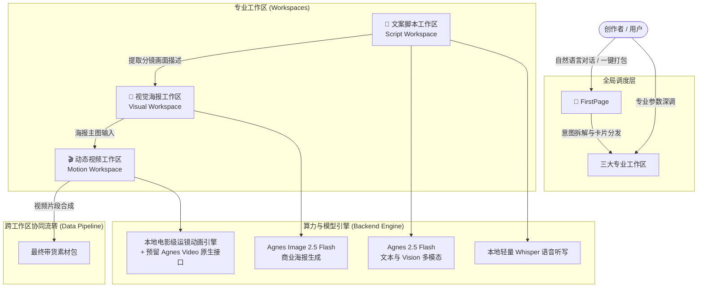

# 电商 AI 创作工作台（AIPannel）系统架构与重构设计方案 (Spec)

## 一、 系统定位与架构概览

电商 AI 创作工作台（AIPannel）旨在为电商与新媒体带货创作者提供**端到端、低门槛、高质感**的多模态内容生成工具。系统围绕核心带货闭环构建：
**“商品卖点提取 ➔ 爆款口播脚本 ➔ 商业主图海报 ➔ 图生运镜短视频”**。

### 1.1 双层交互架构

---

## 二、 命名体系与语义规范

全面弃用“智囊”、“复盘卡点”等陈旧虚浮词汇，统一规范为专业、现代的生产力工作区语义：

| 模块编码 | 界面中文显示 | 英文标识 | 核心定位与职责 |
| :--- | :--- | :--- | :--- |
| `first_page` | **FirstPage** | **FirstPage** | 对话式总览入口，支持一句话全案生成，结果卡片交互呈现并可一键流转。 |
| `visual` | **视觉海报工作区** | **Visual Workspace** | 电商主图、商业海报与场景图生成，多风格预设与垫图融图。 |
| `motion` | **动态视频工作区** | **Motion Workspace** | 图生运镜视频、平滑镜头（Dolly/Pan）、电商卖点花字与光效卡点合成。 |
| `script` | **文案脚本工作区** | **Script Workspace** | 爆款口播、FABE 卖点分解、极限词合规排查、现场原声听写。 |
| `settings` | **系统与模型配置** | **Settings** | API 凭证管理、模型切换与系统运行参数设置。 |

---

## 三、 详细功能模块设计

### 3.1 FirstPage (对话全案总览)
* **定位**：非专业创作者与快速全案生成入口。
* **核心能力**：
  * **一句话全案生成**：输入商品诉求（如：“出套黑曜石香水带货素材，主打持久冷香”），Agent 自动解析意图并并行生成带货文案、调用 Agnes 渲染海报、调用运镜引擎合成 5 秒动态视频。
  * **结构化卡片呈现**：
    * **文案卡片**：输出带货口播 + FABE 结构，附操作按钮 `👉 发送至文案工作区`。
    * **海报卡片**：展示高清生成图，附操作按钮 `👉 发送至海报工作区` / `👉 一键做成运镜视频`。
    * **视频卡片**：内嵌可播放 MP4 视频，附操作按钮 `👉 发送至视频工作区改运镜`。

### 3.2 视觉海报工作区 (Visual Workspace)
* **定位**：静态高画质电商视觉资产生产。
* **核心能力**：
  * **多电商风格预设**：国潮东方、大牌奢华、极简科技、北欧清新、赛博潮流。
  * **双输入模式**：
    * 纯文本 Prompt 描述生成；
    * 商品实物图垫图（通过 Agnes Vision 提取实物特征并反哺融图）。
  * **链路流转**：海报生成后，右下角显著位置提供 `🎬 一键送去生成运镜短视频` 快捷直达按钮。

### 3.3 动态视频工作区 (Motion Workspace)
* **定位**：让静态海报“动起来”的短视频生产区。
* **核心能力（双轨制）**：
  * **轨道 B（本地电影级平滑运镜·默认推荐·0 外部费用）**：
    * **运镜模式**：
      * `dolly_in`：平滑推进镜头（电影感缓入，画面细节逐渐放大）
      * `pan_right` / `pan_left`：水平横移扫镜
      * `dynamic_float`：微呼吸动态感
    * **带货花字包装**：支持在视频画面自动叠加卖点大字幕（如“持久留香 24H”、“限时特惠”），带淡入淡出动画。
    * **画面规格**：支持 9:16（抖音/小红书/视频号竖屏）与 16:9。
  * **轨道 A（Agnes Video 原生 AI 视频接口）**：
    * 预留标准 `POST /v1/videos` 接口。若用户在设置中开启且账号具有 Token Plan 额度，可无缝切换为真实 AI 视频生成。

### 3.4 文案脚本工作区 (Script Workspace)
* **定位**：文字创意与合规安全中心。
* **核心能力**：
  * **FABE 爆款口播模板**：Feature（特征）、Advantage（优势）、Benefit（利益）、Evidence（佐证）四段论。
  * **新广告法极限词排查**：实时扫描违禁违规词（如“全网第一”、“最顶级”、“保证疗效”等）并给出修改建议。
  * **语音素材快速听写**：集成本地轻量快速 Whisper，上传带货录音即刻转出清晰文本，辅助提取金句。
  * **分镜联动**：生成脚本后，提供 `🎨 提取分镜生成海报` 按钮，自动将分镜描述填入海报工作区。

---

## 四、 后端 API 接口设计 (`server.py`)

| 请求路径 | 方法 | 职责说明 | 关键入参 | 关键返回 |
| :--- | :---: | :--- | :--- | :--- |
| `/api/chat` | POST | 创作总控对话与意图识别 | `messages`, `mode='copilot'` | 流式/结构化响应、卡片 action 指令 |
| `/api/generate-image` | POST | Agnes 商业海报生图 | `prompt`, `style`, `aspect_ratio` | `image_url`, `local_path` |
| `/api/motion-video/create`| POST | 运镜短视频生成（本地/云端） | `image_url`, `motion_type`, `caption` | `video_url`, `local_path`, `duration` |
| `/api/script/generate` | POST | 带货脚本与合规排查 | `product_name`, `selling_points`, `type` | `fabe_script`, `risk_words`, `scenes` |
| `/api/audio/transcribe` | POST | 本地音频语音听写 | 二进制音频文件 | `transcript_text`, `duration` |
| `/api/settings/save` | POST | 保存系统与 API 凭证 | `agnes_api_key`, `video_mode` 等 | `success: true` |

---

## 五、 重构实施步骤与验证计划

1. **第一阶段：后端核心引擎与数据流重构 (`server.py`)**
   - 接入 Agnes 文本与生图引擎为系统主力；
   - 编写本地高质量平滑运镜动画渲染器（FFmpeg 平滑插值 + 花字叠加）；
   - 梳理并重写规范化的 REST API 接口，去除无用的旧代码与假切片逻辑。
2. **第二阶段：前端界面与工作区重构 (`index.html`)**
   - 全面更新侧边栏导航为“创作总控台”与三大“工作区”；
   - 首页总控台实现基于卡片流的智能交互与一键分发；
   - 优化三大工作区的独立操作界面与跨工作区流转按钮。
3. **第三阶段：全链路联调与验证**
   - 端到端测试：从总控台输入需求 ➔ 脚本输出 ➔ 海报生成 ➔ 视频渲染 ➔ 预览下载；
   - 验证服务常驻与公网隧道访问状态。
